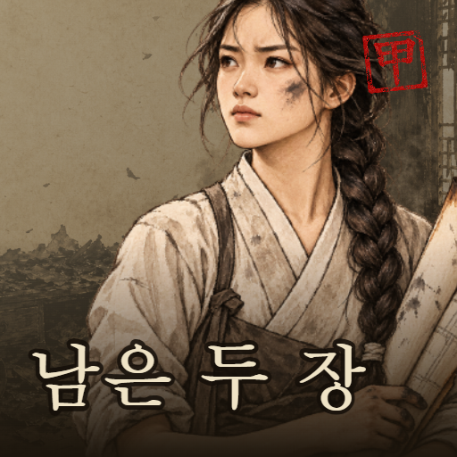

# 남은 두 장

> 도면실이 탔다. 남은 것은 정면도와 측면도, 두 장뿐이다.

두 장의 도면만 보고 사라진 건물을 다시 세우는 3D 퍼즐. 앞에서 본 모양과 옆에서 본 모양이
동시에 맞아떨어지는 자리를 찾아 자재를 하나씩 올린다.

**▶ [지금 해 보기](https://verse8.io/Z7N4v9d)**



---

## 게임 설명

- **층을 골라 그 층만 세운다.** 정면도와 측면도에서 같은 줄을 하나씩 읽어 내려가는 것이
  푸는 방법이다.
- **자재는 도면에 적힌 수만큼만** 주어진다. 한 칸이라도 남거나 모자라면 검수에 못 올린다.
- **다 세웠다고 끝나지 않는다.** 스스로 맞다고 판단해 검수에 올리는 것이 이 일의
  마지막 손질이다. 화면은 맞았다고 먼저 말해 주지 않는다.
- 되돌리기도 힌트도 안 쓰고 세우면 **갑(甲)**. 도장이 찍히고 엽전이 든다.
- 창고 4×4 에서 성문 5×5×5 까지, 부지가 커질수록 읽어야 할 줄이 늘어난다.
- **끝없이 풀기** — 잘못 놓기 세 번이면 끝. 멀리 간 사람이 순위표에 오른다.

한국어 · English · 日本語 · 繁體中文.

---

## 만든 방식

Vite 바닐라 자바스크립트. 프레임워크도, 그리기 라이브러리도 쓰지 않았다.

| | |
|---|---|
| 3D 부지 | SVG. 카메라로 돌려 화면에 옮기고, 먼 것부터 칠해 가림을 맞춘다 |
| 효과음 | 전부 코드로 만든다. 짧은 잡음을 좁은 체에 통과시키고 낮은 음을 빠르게 죽여 겹친다 |
| 판에서 나는 소리 | 평조 다섯 음을 그때그때 뽑는다. 같은 자리로 안 돌아오니 외워질 것이 없다 |
| 저장 | 브라우저와 계정 양쪽. 붙는 순간 큰 쪽으로 합친다 |
| 플랫폼 | Verse8 — 순위표 · 보상형 광고 · 상점 |

```
game/src/
  core/     grid.js  levels.js  generator.js    판 · 도면 · 판 뽑기
  render/   camera.js  scene3d.js  plans.js     부지 · 도면 그리기
  input/    pick.js  rotate.js                  누르기 · 돌리기
  game/     stages.js  hero.js  dialogue.js     의뢰 · 복원공 · 대사
            progress.js  economy.js  hint.js    저장 · 엽전 · 힌트
  ui/       screens.js  talk.js  sound.js       화면 · 대화 · 효과음
            bgm.js  ambient.js  style.css       배경 음악 · 판 소리
  platform/ boot.js  backend.js  account.js     Verse8 붙이기
            ads.js  shop.js  leaderboard.js
  i18n/     ko  en  ja  zh                      네 나라 말
server.js                                       게임 서버 (저장소 루트여야 한다)
```

---

## 도면 두 장으로는 답이 하나로 안 정해진다

이 게임을 만들며 가장 오래 붙든 것이라 적어 둔다.

한 층에서 정면도가 깊이 k칸, 측면도가 가로 k칸을 켜라 하면, 그 층에 놓는 방법은 **k! 가지**다.
스무 판 중 답이 하나뿐인 판은 하나도 없다.

그래서 검수는 원래 배치와 같은지 보지 않는다. **두 도면과 자재 수만** 본다. 원본 설계도는
불에 탔고, 아무도 원래 모습을 모른다 — 두 장에 맞으면 그것이 복원이다.

여기서 따라오는 것이 하나 더 있다. **자재를 늘리면 오히려 헐거워진다.** k 가 커질수록
그 줄의 답이 k! 로 불어나기 때문이다. 그래서 난이도는 자재가 아니라 **줄 수와 바닥
넓이**로 올렸고, 마지막 의뢰에서는 도면 한쪽 칸 수를 줄여 뽑아 찍힌 칸만 세어서는 자재
수가 안 나오게 했다.

---

## 문서

| | |
|---|---|
| [PLAN.md](PLAN.md) | 어디에 뭐가 있나, 손대 본 뒤 알게 된 것들 |
| [VERSE8.md](VERSE8.md) | 플랫폼 붙이는 법 |
| [ART.md](ART.md) | 그림 주문서 — 화풍 블록과 프롬프트 |

## 출처

- 그림 — 이미지 생성 모델로 뽑아 손봤다. 프롬프트는 [ART.md](ART.md)
- 배경 음악 — Seoul Flow (Pixabay Content License).
  출처는 [game/public/audio/CREDITS.md](game/public/audio/CREDITS.md)
- 효과음과 판에서 나는 소리 — 코드로 만든다. 받아 온 파일이 없다
